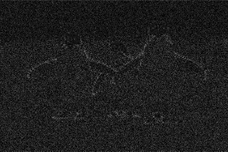

# Abstract
Image analysis includes changing the characteristics of an image to improve its visual information. However, images are constantly polluted with external and internal noise environments during the capturing process of the image. As a result, different image analysis techniques are applied to the images to reduce such noises and enhance the image quality. This report will experiment with other image analysis techniques to see which approach provides the most favourable results.

# Introduction 
During the capturing process of an image, the images are constantly polluted with external and internal noise. Therefore, to improve the quality of a distorted image, we can remove noises such as periodic and random noise. To do this, we must develop algorithms in both the frequency and spatial domains. 

A domain is a set of values that a function can take. Thus, the frequency domain would be a set of frequencies that an image can take and a representation of an image as a function of frequency. Therefore, we will translate the image into its Fourier Transform to remove noise by analysing them in the FFT or DFT and applying filters according to the noise.

An image's spatial domain consists of all points it can occupy in space. Images are functions of their positions, so the spatial domain is the set of all areas' positions. Therefore, we will apply different filters to reduce the random noises in the image.

# Methodology
The frequency domain has some advantages over the spatial domain. A signal can be decomposed into sinusoidal components using the Fourier transform, making it easier to analyse in the frequency domain. This decomposition is not possible in the spatial domain. Signals are often more compact in the frequency domain than in the spatial domain. Therefore, we will conduct frequency analysis first, then the spatial.

## Process overview

This diagram represents the stages of image analysis we are going to perform:

1. We will pass the noise image as the input.
1. It will get translated into the Frequency Domain. Thirdly we will apply the filters to the Frequency Domain.
1. We will transform the image to the Spatial Domain and then use filters for the Special Domain.
1. We will have the enhanced version of the image.

## Frequency Domain
An image is represented by the Fourier transform as a sum of complex exponentials of varying magnitudes, frequencies, and phases. Several image processing applications use the Fourier transform for enhancement and compression. A Fourier Transform is a tool used for analysing images. It breaks them down into sines and cosines. The input of the transformation is the image in its spatial domain, and the output is the image in its frequency domain. Each point in the Fourier domain image represents a particular frequency in the spatial domain image. [1]

### FFT & DFT
The Discrete Fourier Transform (DFT) is a type of the Fourier transform that calculates the spectrum of a finite-duration signal. The discrete Fourier transform, or DFT, converts time domain signals into frequency domain components. [2]

###
The Fast Fourier Transform (FFT) is an enhanced version of the DFT. The FFT produces almost the same results as the DFT but is much more efficient and faster. In addition, it results in a significant reduction in computation time. It uses a Divide and Conquer technique, which allows the algorithm's time complexity to go from N^2 in a DFT to N log2 N. For example, for an image with a size of 256x256, FFT decreases the multiplications from a factor of 10^9 to a factor of 10^6. For instance, an image with size 256x256 changes the time from just over an hour to only a second. Therefore, we will consider implementing FFT over DFT because of its speed.

|

|
| :-: |
|
We converted the given image with noises into the frequency domain by using the NumPy library to transform the image into a Fourier Transform. 

The fft.fft2() computes the 2-dimensional FFT on the n-dimensional discrete Fourier Transform over any axes in an M-dimensional array using the Fast Fourier Transform (FFT).
|

|

|
The frequency domain enables us to see the noises with naked eye. All of the noises in the frequency domain are circled and arrowed in red. These areas are where there is predominantly noise that must be removed. 

|
| :-: | :- |

|

|
| :-: |
|
We will shift the noises from the edges of the Frequency Domain to the centre, which is achieved by using the fftshift() method to shift the zero-frequency component to the centre of the spectrum.

Now that we have most of the noises in the centre, we can start applying the filter to the frequency domain. Such as low pass, high pass, band pass and band stop.
|
### High-Pass Filter
High-Pass Filtering is used for image sharpening. An image is sharpened when there are no substantial differences between adjacent areas in brightness or darkness. In an image, a high pass filter reduces the low-frequency information while maintaining the high-frequency data. The kernel of the high-pass filter increases the brightness of the centre pixels in relation to its adjacent pixels. The positive value is at the centre of a kernel array, while the negative values surround it. While a low pass filter smoothens an image, the high pass filter amplifies the noise and hence the edges of the image.  

||
| :-: |
|
The High pass filter is created using the custom-coded algorithm, including the high pass formula. In the image on the left-hand side, we made the high-pass filter and then applied it to the frequency domain shift, as shown in the image on the right. Finally, the filter is applied by multiplying the frequency domain shift with the created filter in the image on the left-hand side. The filter we applied in the centre of the frequency domain shift blocks the high frequency, and its intensity depends on the filter's radius. 

While testing the high pass filter, we identified that the size of the radius dictates the changes in the sharpness of the edges. A higher radius has less sharpness than a low radius, as shown in the images below.
|

|

|
| :-: |
|Once we apply the filter to the centre of the frequency domain, we conduct the Inverse Fourier Shift. We then move the frequency domain from the middle to the upper left corner, which is done using the inverse the fftshift() method. Although identical for even-length x, the functions differ by one sample for odd-length x. Therefore is essential to use even values with the fftshift() method.|

|

       

|
| :-: |
|
These images were produced by applying the inverse Fourier transform. The inverse Fourier transform is a mathematical formula that converts a signal in the frequency domain to one in the Spatial domain.

These images are the result of using the high pass filter. The image on the left is a result of using a radius of 50, while the image on the right has a radius of 20. So, we can conclude that the lower the radius, the sharper the edges are on the image.
|

### Low-Pass Filter
Contrary to high-pass filtering, low-pass filtering is used for smoothening. An image can be smoothened by decreasing the difference between pixel values, which can be done by nearby averaging pixels. Using a low-pass filter removes high-frequency information while keeping low-pass information.  

Image noise, such as Salt and Pepper, and gaussian noise, can be filtered with low-pass filtering. Therefore, such noises have high pixel values of 255, which are then filtered out. However, low pass filtering does not recognize that they are specific types of noises and removes areas of the image with a high frequency of 255. Due to this reason, low-pass filters essentially keep the centre part of the image where the low-pixel values are while setting the pixel value of the high-frequency region to 0.

|

         
|
| :-: |
|
The low pass filter is created using the custom-coded algorithm, including the low pass formula. In the image on the left-hand side, we made the low-pass filter and then applied it to the frequency domain shift, as shown in the image on the right. Finally, the filter is applied by multiplying the frequency domain shift with the created filter in the image on the left-hand side. The filter we applied in the centre of the frequency domain shift blocks the low frequency, and its intensity depends on the filter's radius. 

While testing the low pass filter, we identified that the size of the radius dictates the changes in the smoothness. A lower radius has more smoothness than a higher radius, as shown in the images below.
|

|

|
| :-: |
|Once we apply the filter to the centre of the frequency domain, we conduct the Inverse Fourier Shift. We then move the frequency domain from the middle to the upper left corner, which is done using the inverse the fftshift() method. Although identical for even-length x, the functions differ by one sample for odd-length x. Therefore is essential to use even values with the fftshift() method.|

|

      

|
| :-: |
|
These images were produced by applying the inverse Fourier transform. The inverse Fourier transform is a mathematical formula that converts a signal in the frequency domain to one in the Spatial domain.

These images are the result of using the low pass filter. The image on the left is a result of using a radius of 50, while the image on the right has a radius of 70. So, we can conclude that the lower the radius, the smoother the features are on the image.
|

### Bandpass Filter
A bandpass filter keeps values corresponding to frequencies within a given interval and reduces the effect of frequencies outside the interval. The technique is used when the frequency domain noise is known.

||
| :-: |
|
The band pass filter is created using the custom-coded algorithm, including the band pass formula. In the image on the left-hand side, we made the band pass filter and then applied it to the frequency domain shift, as shown in the image on the right. Finally, the filter is applied by multiplying the frequency domain shift with the created filter in the image on the left-hand side. The filter we applied in the centre of the frequency domain shift blocks the high frequency, and its intensity depends on the filter's radius. 

While testing the band pass filter, we identified that the size of the radius dictates the changes in the sharpness of the edges. A higher radius has less sharpness than a low radius, as shown in the images below.
|

|

|
| :-: |
|Once we apply the filter to the centre of the frequency domain, we conduct the Inverse Fourier Shift. We then move the frequency domain from the middle to the upper left corner, which is done using the inverse the fftshift() method. Although identical for even-length x, the functions differ by one sample for odd-length x. Therefore is essential to use even values with the fftshift() method.|

|                         |
| :-: |
|
These images were produced by applying the inverse Fourier transform. The inverse Fourier transform is a mathematical formula that converts a signal in the frequency domain to one in the Spatial domain.

These images are the result of using the band pass filter. The image on the left is a result of using a radius of 50/100, while the image on the right has a radius of 40/80. So, we can conclude that the lower the radius, the sharper the edges are on the image.
|

### Band Stop Filter
The Band Stop Filter (BSF) is a type of frequency-selective filter. A band-stop filter passes all frequencies except those within a specified stop band.

||
| :-: |
|
The band stop filter is created using the custom-coded algorithm, including the band stop formula. In the image on the left-hand side, we made the band stop filter and then applied it to the frequency domain shift, as shown in the image on the right. Finally, the filter is applied by multiplying the frequency domain shift with the created filter in the image on the left-hand side. The filter we applied in the centre of the frequency domain shift blocks the low frequency, and its intensity depends on the filter's radius. 

While testing the band stop filter, we identified that the size of the radius dictates the changes in the smoothness. A lower radius has more smoothness than a higher radius, as shown in the images below.
|

|

|
| :-: |
|Once we apply the filter to the centre of the frequency domain, we conduct the Inverse Fourier Shift. We then move the frequency domain from the middle to the upper left corner, which is done using the inverse the fftshift() method. Although identical for even-length x, the functions differ by one sample for odd-length x. Therefore is essential to use even values with the fftshift() method.|

|

         

|
| :-: |
|
These images were produced by applying the inverse Fourier transform. The inverse Fourier transform is a mathematical formula that converts a signal in the frequency domain to one in the Spatial domain.

These images are the result of using the low pass filter. The image on the left is a result of using a radius of 50/100, while the image on the right has a radius of 60/120. So, we can conclude that the lower the radius, the smoother the features are on the image.
|

### Fourier Transform Results and Discussions

|          |
| :-: |
|
After testing the four frequency domain filters, only two produced the best result. The image on the left-hand side is a band-stop filter; it has removed a lot of the noise and is not blurry. Whereas the image on the right is a low pass filter, it has removed a lot of noise and made the image blurry.

The two images retained the unique features that the other one has; even the visuals appear quite similar. Therefore, I considered further testing these images in the spatial domain.
|

## Spatial Domain
The Spatial domain of an image is the set of all points in space that the image can occupy. The image is a function of position, so the spatial domain is the set of all positions in the area. We use the spatial domain method to compute grey levels of pixels, such as the change of grey levels, histogram correction and more. The spatial filtering methods consist of mean, median, bilateral filters etc.  

|           |
| :-: |
|The image on the left-hand side used the band stop filter, while image on the right-hand side used the low pass filter. The band stop filter produced a higher quality image when comparing the two images.|

### Mean Filter
Mean filtering smoothens images and removes noise by removing the amount of intensity variation between different pixels. It works by replacing each pixel with the mean value of neighbouring pixels. While mean filtering does reduce noise, it does not reduce it by a significant amount as well as it can introduce blur into the image. This is because of the problems that come with using mean filters. In mean filtering, a single pixel with an unrepresentative value can significantly affect the mean value of all the pixels in its neighbourhood. Another disadvantage comes from the edge pixels; since there aren't enough neighbouring pixels, the filter will have to introduce new pixels, which causes the edge to blur.  

|              |
| :-: |
|The image on the left-hand side used the band stop filter combined with the mean filter, while image on the right-hand side used the low pass filter combined with the mean filter. The images produced have very similar quality. |

### Median Filter
However, these two issues can be resolved using a median filter. Like the mean filter, the median filter uses the neighbouring pixels to remove noise in the image. It does this by sorting the adjacent pixels surrounding the pixel in numerical order and then calculating the median value to replace it with. Even if there is an unrepresentative value in the neighbourhood, it will not affect the value as much as if it were the mean. It also removes the problem of the edge pixels creating a blur. This is because the filter does not need to make any new pixels as it just uses the median value, even if only a couple of values exist.  [3]

The problem with median filtering is how expensive and complex it can be. Ordering the values and then finding the median can take a long time, using many resources.  

|           |
| :-: |
|The image on the left-hand side used the band stop filter combined with the median filter, while image on the right-hand side used the low pass filter combined with the median filter. However, both produced quite blurry images. |

### Bilateral Filter
The bilateral filter is a smoothing filter that preserves the edges of an image and reduces noise at the same time. A weighted average of the intensity values of nearby pixels replaces the intensity of each pixel. This weight can be based on a Gaussian distribution. [4]

|              |
| :-: |
|The image on the left-hand side used the band stop filter combined with the bilateral filter, while image on the right-hand side used the low pass filter combined with the bilateral filter. |

### Spatial Domain Results and Discussion

|

|
Though at first, the band pass filter produced a better-quality image than the low pass filter when used alone. When we combined the filter with the bilateral filter, produced a better-quality image using the low pass filter.

When comparing this image to the other images that used the other features, we can also conclude that the bilateral filter produced the most favourable result.
|
| :-: | :- |

## Mean Squared Error (MSE)
An image can be measured and or evaluated using various techniques, whether that be subjectively or in this case by using the Mean Squared Error (MSE). The MSE can be represented using the formula: 

 

Where the closer the value of the MSE is to zero, the “better” the image. While the MSE is a common evaluation metric of image quality, a low error MSE value may not necessarily look subjectively pleasing. [5] 

||
We passed the original distorted image and the filtered image (Low Pass+Bilateral) to the MSE method we made using the above formula.

The closer the MSE is to 0, the lower the error; our MSE is  0.00067389. Therefore, we removed the image noise drastically even though the image is not visually pleasing.
|
| :- | :- |
# References
[1] - homepages.inf.ed.ac.uk. (n.d.). *Digital Filters - Frequency Filters*. [online] Available at: <https://homepages.inf.ed.ac.uk/rbf/HIPR2/freqfilt.htm>.

[2] - Alaa, A. (n.d.). *Week 3: Images in Frequency Domain*. [online] Tutorials for SBME Students. Available at: <https://sbme-tutorials.github.io/2018/cv/notes/3_week3.html>.

[3] - Ed.ac.uk. (2020). *Spatial Filters - Median Filter*. [online] Available at: <https://homepages.inf.ed.ac.uk/rbf/HIPR2/median.htm>.

[4] - www.l3harrisgeospatial.com. (n.d.). *BANDPASS\_FILTER*. [online] Available at: <https://www.l3harrisgeospatial.com/docs/bandpass_filter.html>.

[5] - Wikipedia Contributors (2019). *Mean squared error*. [online] Wikipedia. Available at: <https://en.wikipedia.org/wiki/Mean_squared_error>.

‌

‌

‌

‌

‌

