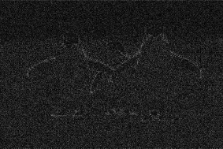
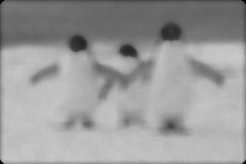

Module Code: CS3IA16

Assignment report Title: Image Analysis

Student number:  28003801, 29007309

Date: 28/10/2022

Actual hrs spent for the assignment: 45

Assignment evaluation (3 key points): Good, Challenging, Informative

# Table of Contents
[Abstract	1](#_Toc117809426)

[Introduction	2](#_Toc117809427)

[Methodology	2](#_Toc117809428)

[Process overview	2](#_Toc117809429)

[Frequency Domain	2](#_Toc117809430)

[FFT & DFT	2](#_Toc117809431)

[High-Pass Filter	4](#_Toc117809432)

[Low-Pass Filter	5](#_Toc117809433)

[Bandpass Filter	6](#_Toc117809434)

[Band Stop Filter	8](#_Toc117809435)

[Fourier Transform Results and Discussions	9](#_Toc117809436)

[Spatial Domain	9](#_Toc117809437)

[Mean Filter	10](#_Toc117809438)

[Median Filter	10](#_Toc117809439)

[Bilateral Filter	11](#_Toc117809440)

[Spatial Domain Results and Discussion	11](#_Toc117809441)

[Mean Squared Error (MSE)	11](#_Toc117809442)

[Conclusion	12](#_Toc117809443)

[References	13](#_Toc117809444)

[Appendix	14](#_Toc117809445)

[Frequency domain code	14](#_Toc117809446)

[Spatial domain code	16](#_Toc117809447)

[MSE code	17](#_Toc117809448)

# Abstract

# Introduction 

# Methodology

## Process overview

## Frequency Domain

### FFT & DFT

|                  |
| :- |
||

|||
| :- | :-: |

|                 |
| :- |
||
### High-Pass Filter

|                  |
| :- |
||

|               |
| :- |
||

|               |
| :- |
||

### Low-Pass Filter

|              |
| :- |
||

|               |
| :- |
||

|             |
| :- |
||

### Bandpass Filter

|             |
| :- |
|

|

|               |
| :- |
||

|                         |
| :-: |
||

### Band Stop Filter

|                  |
| :-: |
||

|                     |
| :- |
||

|                                              |
| :- |
||

### Fourier Transform Results and Discussions

|                        |
| :- |
||

## Spatial Domain

|                        |
| :- |
||

### Mean Filter

|                          |
| :- |
||

### Median Filter

|                         |
| :- |
||

### Bilateral Filter

|                                 |
| :- |
| |

### Spatial Domain Results and Discussion

|||
| :- | :- |

## Mean Squared Error (MSE)

|||
| :- | :- |

# Conclusion

# References
[1] - homepages.inf.ed.ac.uk. (n.d.). *Digital Filters - Frequency Filters*. [online] Available at: <https://homepages.inf.ed.ac.uk/rbf/HIPR2/freqfilt.htm>.

[2] - Alaa, A. (n.d.). *Week 3: Images in Frequency Domain*. [online] Tutorials for SBME Students. Available at: <https://sbme-tutorials.github.io/2018/cv/notes/3_week3.html>.

[3] - Ed.ac.uk. (2020). *Spatial Filters - Median Filter*. [online] Available at: <https://homepages.inf.ed.ac.uk/rbf/HIPR2/median.htm>.

[4] - www.l3harrisgeospatial.com. (n.d.). *BANDPASS\_FILTER*. [online] Available at: <https://www.l3harrisgeospatial.com/docs/bandpass_filter.html>.

[5] - Wikipedia Contributors (2019). *Mean squared error*. [online] Wikipedia. Available at: <https://en.wikipedia.org/wiki/Mean_squared_error>.

‌

‌

‌

‌

‌

# Appendix
## Frequency domain code

|
1.1 - The code includes: low pass, high pass, band pass and band stop filters code.

CS GitLab Link: <https://csgitlab.reading.ac.uk/xy003801/cs3ia16-image-analysis.git> 
|
| :- |
|

|

## Spatial domain code

|
1.2 – The code includes: mean, media and bilateral filters code.

`   `CS GitLab Link: <https://csgitlab.reading.ac.uk/xy003801/cs3ia16-image-analysis.git>
|
| :- |
||

## MSE code

|
1.3 – The code includes: code to calculate MSE.

`          `CS GitLab Link: <https://csgitlab.reading.ac.uk/xy003801/cs3ia16-image-analysis.git>
|
| :- |
||

